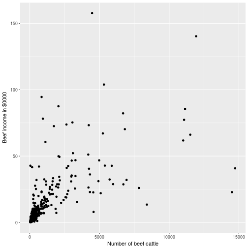

# Beef data from Dorfman (1993) and Chambers et al. (1993)
`dataBeef` contains the data from  the papers
- "Dorfman, A. H. (1993), "A Comparison of Design-Based and Model-Based
 Estimators of the Finite Population Distribution Function. The Australian
 Journal of Statistics, 35 and 
- "Chambers, Raymond L., Alan H. Dorfman, and Thomas E. Wehrly. "Bias robust estimation in finite populations using nonparametric calibration." Journal of the American Statistical Association 88.421 (1993): 268-277.
 


## 1. How to install the package

```r
devtools::install_github("DanielBonnery/dataBeef")
```


## 2. Reproduction of the figure computations made on CPS data. 

  "The population considered here is defined by 430 farms  with 50 or more beef cattle that participated in the 1988  Australian Agricultural and Grazing Industries Survey carried out by the Australian Bureau of Agricultural and Resource Economics. The Y variable is income from beef, and  the X variable is the number of beef cattle on the farm. Figure  1 is a scatterplot of Y versus X for these farms. This shows that Yis roughly proportional to X, but that the relation
 is by no means linear over the entire range of X. We also  observe that the variability of Y increases with X, but not  necessarily in a systematic fashion."


```r
library(dataBeef)
data(beef)
require(ggplot2)
ggplot(beef,aes(x,y/10000))+geom_point()+xlab("Number of beef cattle")+ylab("Beef income in $0000")
```


